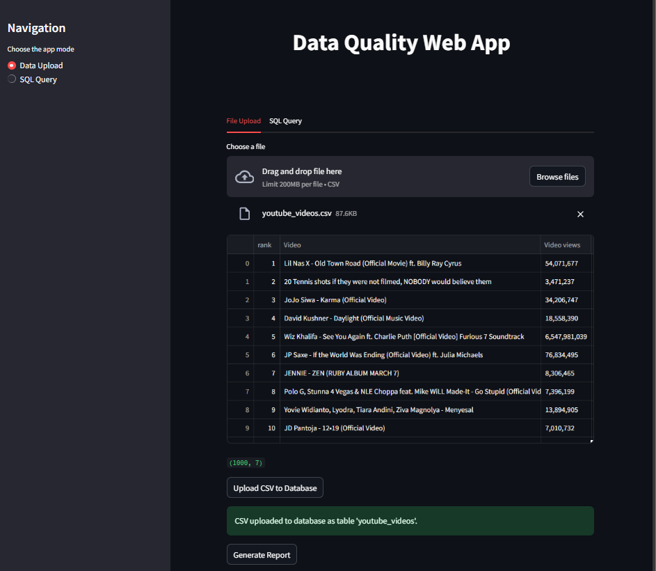
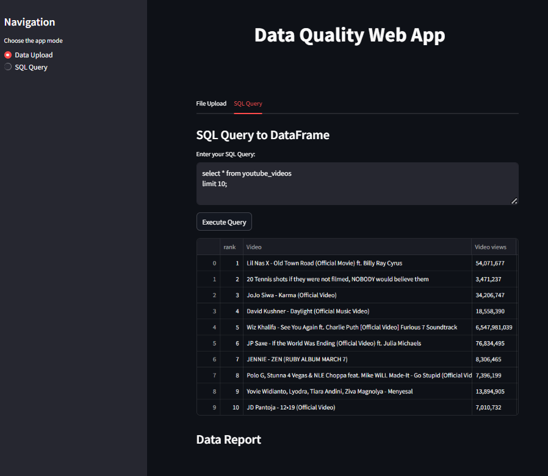

# Streamlit Data Profiling & Reporting Platform


A professional, user-friendly web application for data profiling, reporting, and SQL-based data exploration, built with Streamlit and PostgreSQL.

---






---

## Table of Contents
- [Features](#features)
- [Getting Started](#getting-started)
- [Project Structure](#project-structure)
- [Security & Best Practices](#security--best-practices)
- [Other Projects in this Repository](#other-projects-in-this-repository)
- [Contact](#contact)

## Features

- **Data Upload:**
  - Upload CSV files and preview your data instantly.
  - Generate comprehensive data profiling reports (using ydata-profiling) with a single click.
  - Save reports as HTML for easy sharing and review.
  - Upload your CSV data directly to a PostgreSQL database for further analysis.

- **SQL Query Interface:**
  - Run custom SQL queries against your uploaded data in PostgreSQL.
  - Instantly view query results as interactive tables.
  - Generate profiling reports from query results.

- **Modern UI:**
  - Clean, tabbed interface for seamless navigation between file upload and SQL query modes.
  - Sidebar navigation for quick access.

## Getting Started

### Prerequisites
- Python 3.8+
- [PostgreSQL](https://www.postgresql.org/download/)

### Installation
1. **Clone the repository:**
   ```sh
   git clone https://github.com/your-username/your-repo-name.git
   cd your-repo-name/web_app/Data_Profiling_&_Reporting_Platform
   ```
2. **Install dependencies:**
   ```sh
   pip install -r requirements.txt
   ```
3. **Configure Database Credentials:**
   - Create a `postgres_creds.json` file in the `web_app/Data_Profiling_&_Reporting_Platform` directory with the following format:
     ```json
     {
       "POSTGRES_USER": "your_username",
       "POSTGRES_PASSWORD": "your_password",
       "POSTGRES_HOST": "localhost",
       "POSTGRES_PORT": "5432",
       "POSTGRES_DATABASE": "your_database"
     }
     ```
   - **Important:** Add `postgres_creds.json` to your `.gitignore` to keep your credentials safe.

### Running the App
```sh
streamlit run app.py
```
- The app will open in your browser. Use the tabs to upload data, generate reports, or run SQL queries.

## Project Structure
```
web_app/
  Data_Profiling_&_Reporting_Platform/
    app.py                # Main Streamlit app
    database_util.py      # Database connection utilities
    report_util.py        # Data profiling/reporting utilities
    streamlit_util.py     # UI helpers
    requirements.txt      # Python dependencies
    postgres_creds.json   # (Your local DB credentials, not tracked in git)
    html_assets/          # Generated HTML reports
```

## Security & Best Practices
- **Never commit your `postgres_creds.json` file to version control.**
- Use a dedicated database user with limited permissions for this app.
- Regularly update your dependencies for security.
---

**Enjoy fast, interactive data profiling and reporting!**

---

## Other Projects in this Repository

This repository also contains the following learning/demo apps (not the main professional focus):

- **Sign-up Page:** Simple user registration form with profile photo upload.
- **Graphical Calculator:** Interactive calculator for plotting mathematical functions.
- **Data Quality Reporting:** Automated data quality analysis using ydata-profiler.

See their respective folders for details.

---

## Contact

- **Email:** ahd.farz@gmail.com
- **LinkedIn:** [Ahmed Faraz](https://www.linkedin.com/in/ahd-faraz/)
